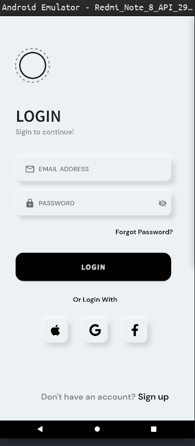
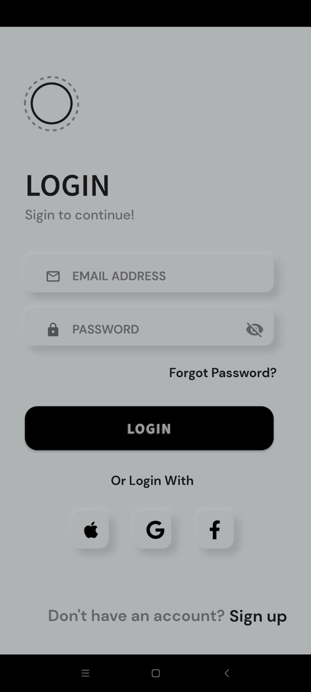

### Day2 Challenge (Login UI)

**Inspiration** : https://search.muz.li/NTY3ZWFhODVi?utm_source=muz.li-insp&utm_medium=article&utm_campaign=%2Finspiration%2Flogin-screen%2F

Responsive and Adaptive Application thanks to ```Sizer``` dart package.

#### External Packages

* ``google_fonts`` : For using google fonts
* ``font_awesome_flutter`` : for using font_awesome icons for google, facebook, apple
* ``dotted_border`` : For creating dotted border in flutter (flutter only has option to create solid or none border)
* ``sizer`` : For responsive design

#### Output on Redmi Note 8 (large screen) and Redmi Note 10S (medium screen).

 
